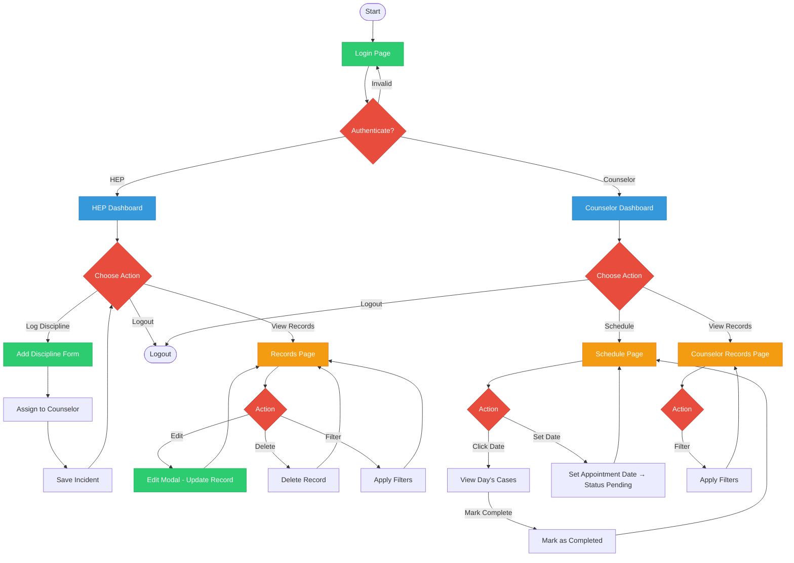

# System Flowchart — E-Disiplin

```mermaid
graph TD
    Start([Start]) --> Login[Login Page]
    Login --> Auth{Authenticate?}
    Auth -->|Invalid| Login
    Auth -->|HEP| HEP_Dash[HEP Dashboard]
    Auth -->|Counselor| CNS_Dash[Counselor Dashboard]

    %% HEP Flow
    HEP_Dash --> HEP_Menu{Choose Action}
    HEP_Menu -->|Log Discipline| AddDisc[Add Discipline Form]
    AddDisc --> AssignCNS[Assign to Counselor]
    AssignCNS --> SaveInc[Save Incident]
    SaveInc --> HEP_Menu

    HEP_Menu -->|View Records| HEP_Records[Records Page]
    HEP_Records --> HEP_RecAct{Action}
    HEP_RecAct -->|Edit| EditModal[Edit Modal - Update Record]
    HEP_RecAct -->|Delete| DeleteRec[Delete Record]
    HEP_RecAct -->|Filter| FilterRec[Apply Filters]
    EditModal --> HEP_Records
    DeleteRec --> HEP_Records
    FilterRec --> HEP_Records

    HEP_Menu -->|Logout| Logout([Logout])

    %% Counselor Flow
    CNS_Dash --> CNS_Menu{Choose Action}
    CNS_Menu -->|Schedule| Schedule[Schedule Page]
    Schedule --> CNS_SchedAct{Action}
    CNS_SchedAct -->|Click Date| CaseModal[View Day's Cases]
    CaseModal -->|Mark Complete| MarkDone[Mark as Completed]
    CNS_SchedAct -->|Set Date| SetAppt[Set Appointment Date → Status Pending]
    SetAppt --> Schedule
    MarkDone --> Schedule

    CNS_Menu -->|View Records| CNS_Records[Counselor Records Page]
    CNS_Records --> CNS_RecAct{Action}
    CNS_RecAct -->|Filter| CNS_Filter[Apply Filters]
    CNS_Filter --> CNS_Records

    CNS_Menu -->|Logout| Logout

    %% Style
    classDef dash fill:#3498db,color:#fff,stroke:#2980b9
    classDef form fill:#2ecc71,color:#fff,stroke:#27ae60
    classDef list fill:#f39c12,color:#fff,stroke:#e67e22
    classDef decision fill:#e74c3c,color:#fff,stroke:#c0392b

    class HEP_Dash,CNS_Dash dash
    class AddDisc,EditModal,Login form
    class HEP_Records,Schedule,CNS_Records list
    class Auth,HEP_Menu,HEP_RecAct,CNS_Menu,CNS_SchedAct,CNS_RecAct decision
```
