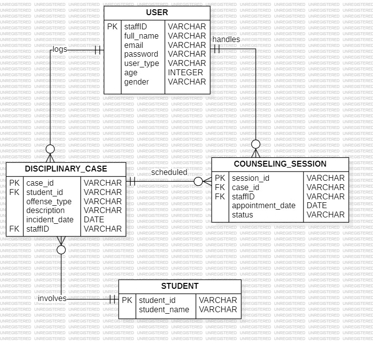

# E-Disiplin

**Student Conduct & Counseling Log** — A centralized ledger for tracking disciplinary records and scheduling mandatory counseling sessions.

---

## Group CS2664A

**Project:** E-Disiplin: Student Conduct & Counseling Log

### Team Members

| No | Matrix ID | Name |
|----|-----------|------|
| 1 | 2025248228 | Mohammed Dzarie Iman Bin Mohammed Dzulhardy |
| 2 | 2025428118 | Nur Raudhatul Imane Binti Mohd Rashid |
| 3 | 2025421242 | Seri Nur Syazwa Binti Ariandi Ahmad |
| 4 | 2025245048 | Shazwana Husna Binti Saari |

---

## User Types & Roles

- **HEP** — Logs new disciplinary incidents and assigns them to counselors
- **Counselor** — Manages appointment schedules and session completion status

---

## Dashboard Trends

### HEP Dashboard
- View total disciplinary cases, most common offenses, pending counseling sessions
- Pie chart of cases by Offense Type
- Line chart of Counseling Session Success Rate

### Counselor Dashboard
- View total, completed, and pending assigned cases
- Completion rate by percentage
- Pie chart of cases by status

---

## Login Credentials

| Role | Staff ID | Password |
|------|----------|----------|
| HEP | HEP001 | 1234 |
| Counselor | CNS001 | 1234 |
| Counselor | CNS002 | 1234 |

---

## Entity Relationship Diagram

